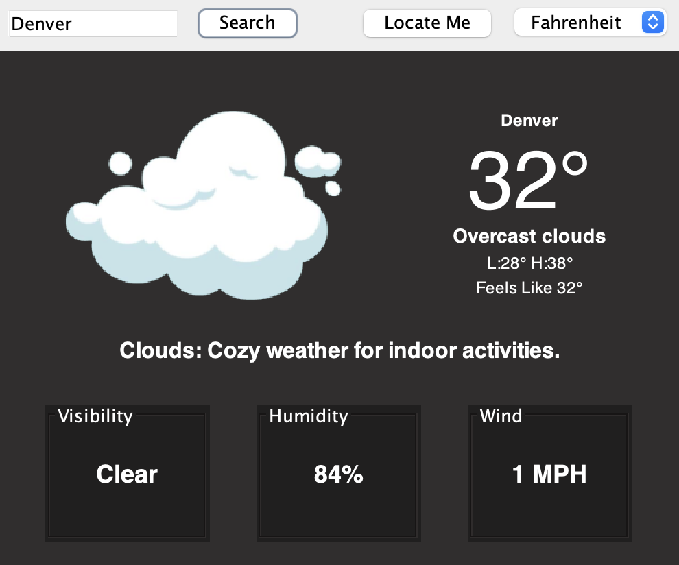
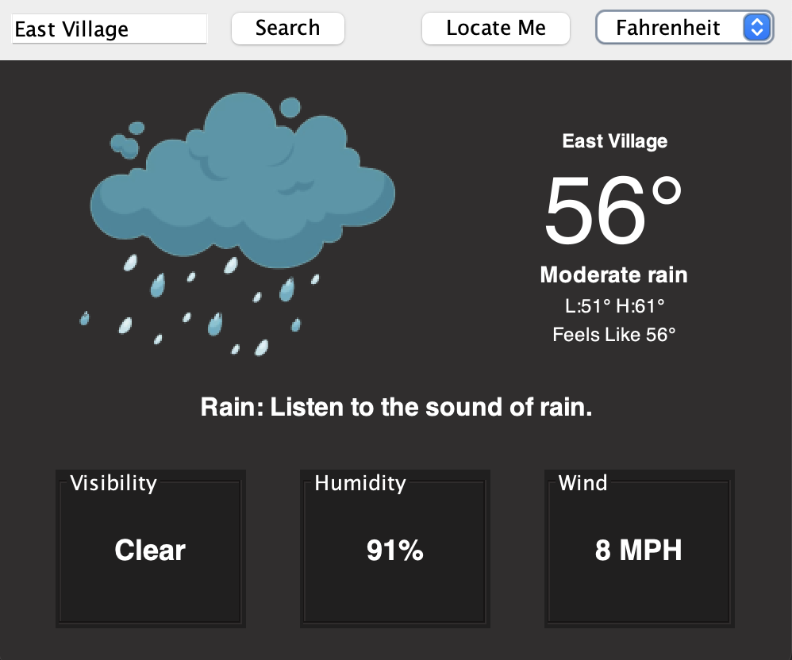
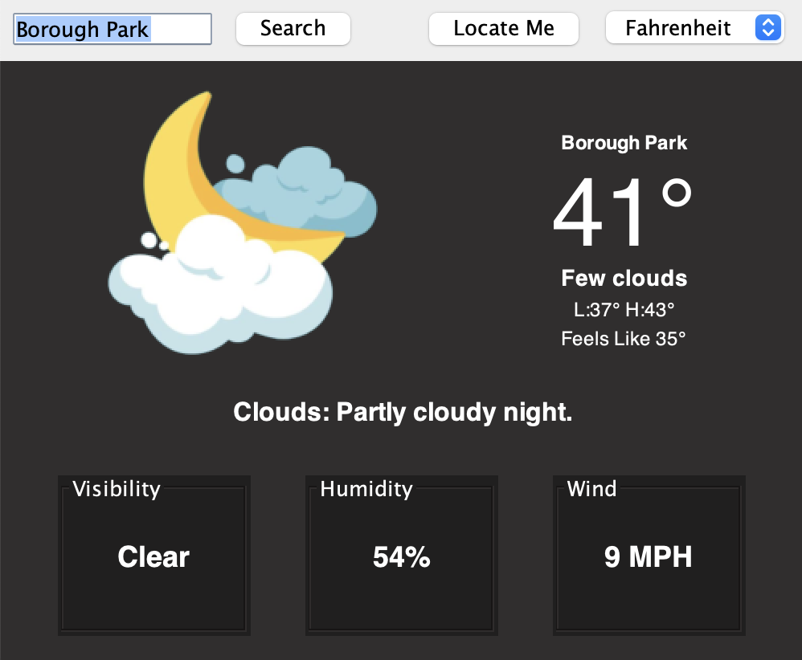

# Java Weather App

A simple Java Swing application that allows users to check the weather for different locations. The app uses the OpenWeatherMap API to fetch real-time weather data and provides a user-friendly interface for viewing weather conditions.

### Academic Information
This project was developed as a final project for **[CS-GY 9053] Intro to Java** at New York University during the Fall semester of 2023.

## Features

- **User-Friendly Interface**: Intuitive and visually appealing graphical user interface (GUI) for easy interaction.
- **Real-Time Weather Data**: Integration with the OpenWeatherMap API to provide current weather conditions, hourly forecasts, and extended daily forecasts.
- **Advanced Java Concepts**: Implementation of advanced Java concepts such as Swing UI, RESTful API integration, data caching, error handling, and geocoding.
- **Data Visualization**: Visual representation of various weather conditions using weather icons.
- **Location Validation**: Validation of user input to ensure accurate weather data retrieval by converting location input into coordinates (latitude and longitude) using OpenCageData API.
- **Error Handling**: Robust error-handling mechanisms to manage network errors, API limitations, and invalid user input gracefully.

## Screenshots

### Cloudy Evening in Denver



### Rainy Day in East Village



### Partly Cloudy Night in Borough Park




## Getting Started

### Prerequisites

- Java Development Kit (JDK) installed
- Eclipse IDE or any Java IDE of your choice

### Installation

1. Clone the repository:
	
```
git clone https://github.com/jeffersonaaron25/Java-Project-Weather-App.git
```
	
2. Open the project in your preferred Java IDE.
3. Configure API Key:
   - Sign up on OpenWeatherMap and OpenCageData to obtain API keys
   - Replace "YOUR_API_KEY" in WeatherService.java and OpenWeatherMapAPI.java with your actual API key.
5. Run the WeatherApp.java file to start the application.

### Usage
 1. Upon launching the application, the default weather for the current location is displayed.
 2. Use the search bar to search for weather in specific cities or 'locate me' button to use your current location.
 3. Choose between Fahrenheit and Celsius temperature units.
 4. Explore current weather conditions such as temperature, humidity, visibility and wind speed.

### License
This project is licensed under the MIT License
 
